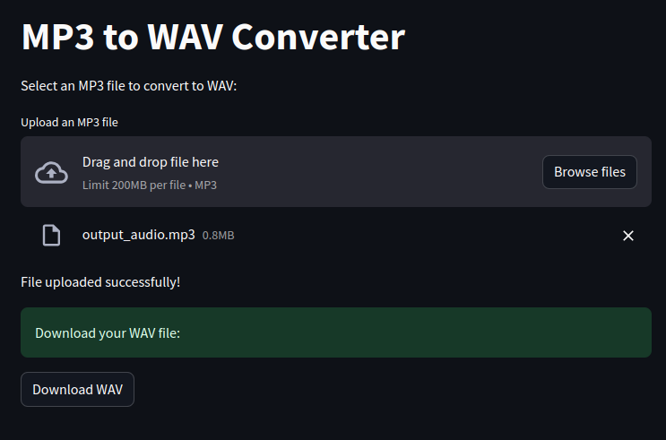

# MP3 to WAV Converter

This is a simple web-based MP3 to WAV converter built using Flask and PyDub.

## Features
- **File Upload:** Upload your MP3 file easily.
- **Conversion:** Converts the uploaded MP3 file to WAV format.
- **Download:** Provides a download link for the converted WAV file.

## How to Use
1. **Upload:** Select an MP3 file using the file uploader.
2. **Conversion:** The app automatically converts the MP3 file to WAV.
3. **Download:** Once the conversion is done, download the converted WAV file.

## Setup
To run this application locally:
1. Clone this repository.
2. cd mp3_to_wav
3. pip install -r requirements.txt
4. Run the application using `python mp3towav.py`.

Feel free to contribute or use it as a reference for building similar tools!
